# Why? 

## Why use Personal Knowledge Management?
Most Information doesn't come in neatly wrapped packages. 
Instead, our brains are regularly flooded with various streams of data, originating from many different sources. 
To better make sense of it all, practicing some kind of personal knowledge management (PKM) is essential. 

## Why use Obsidian?
Obsidian is a powerful and intuitive tool to document and interconnect topics you care about. 
By writing stuff down into a web of personal knowledge, you can gain clarity and also stumble upon serendipitous new insights. 
Compared to other PKM-tools, Obsidian stands out thanks to its focus on locally stored data, which enables offline work and keeps you in control of your data. 
Also, the beautiful visualization options and active community which already created over 2000 plugins allow you to customize Obsidian to your hearts desire. 

# What?

## What is this about?
This crash course is intended for you to quickly master Obsidian by giving you a hands-on introduction to key features and how-to examples. 
Since August 2022, I am outsourcing nuggets of information into Obsidian, which is growing into my second brain. 
If you want to digest your information-overload into meaningful and digestible bytes using a second brain of your own, I highly recommend you check out Obsidian. 

## What is this not about? 
The content shown here was selected by my personal bias.
There is no guarantee that my selection of features and examples will work for you as well. 
To dig deeper, I encourage you to explore the [amazing online documentation of Obsidian](https://help.obsidian.md/). 

# How?

## How to setup Obsidian?

### [download and install](https://obsidian.md/download)
- cross-platform, available for mobile (iOS, Android), and desktop (Windows, Mac, Linux)
- during installation, define the local path of your Obsidian vault

### Settings
Obsidian is highly customizable. 
Here are the settings-changes I find useful. 

#### Editor, set compact view
By default, the note editor window shows a lot of empty space on the left and right side. 
To get a quicker overview of a note, I prefer a more compact view. 
To remove this white space, go to Settings > Editor and turn off the field labeled "Readable line length". 
<div>
  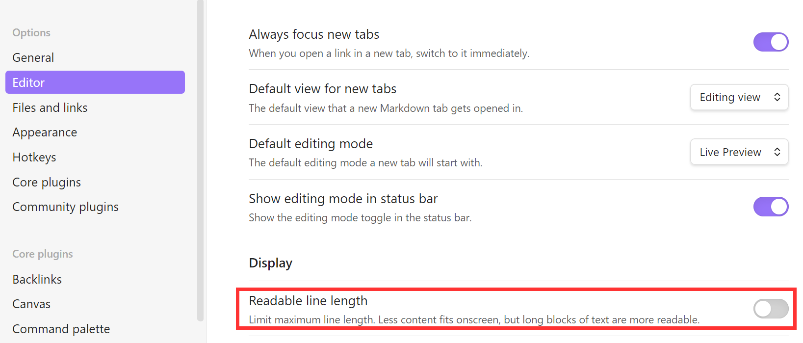
</div>

#### Files and Links, define attachment folder
By default, every new image you paste into a note will be copied as attachment into the root vault folder, which leads to clutter. 
So before starting to paste images into your notes, it makes sense to define a dedicated folder where new attachments will be automatically stored. 

<div>
  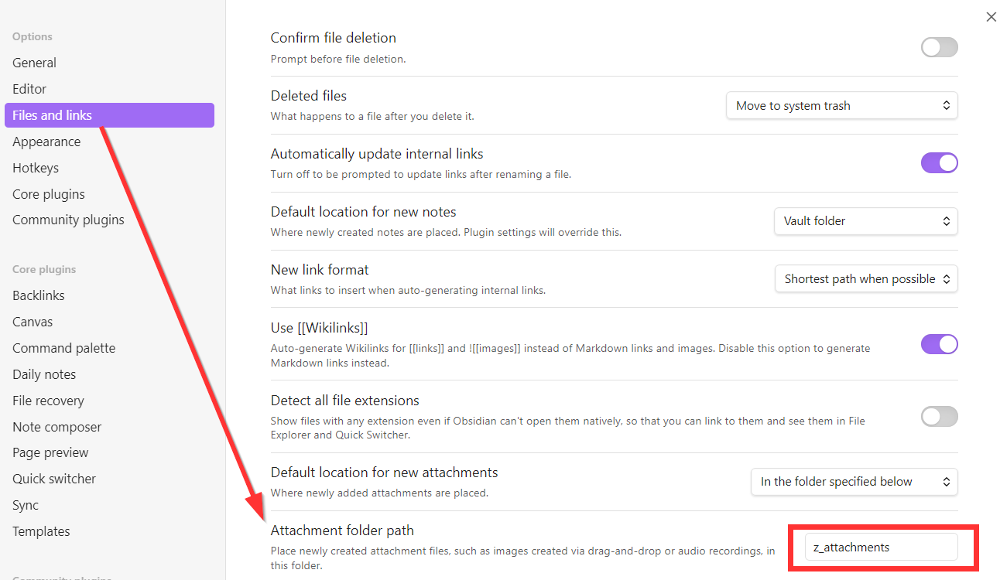
</div>

#### Daily notes, define format and locations
To use Obsidian as a journal, define
- Date format
	- how to label the current-daily-note
- New file location
	- where to store the current-daily-note
- Template file location
	- template on which to base current-daily-note on
- Open daily note on startup
	- I turned this on

<div>
  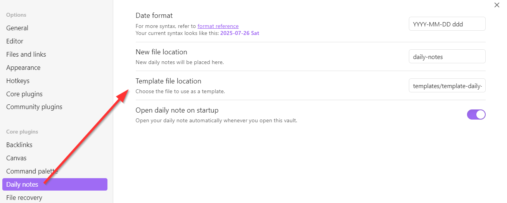
</div>

#### Sync, turn on for plugins
I'm using Obsidian on my laptop and also on my phone. 
This lets me take notes on the go and refactor them later by using a keyboard. 
To ensure there are no synchronization errors, I turned on plugin synchronization. 

<div>
  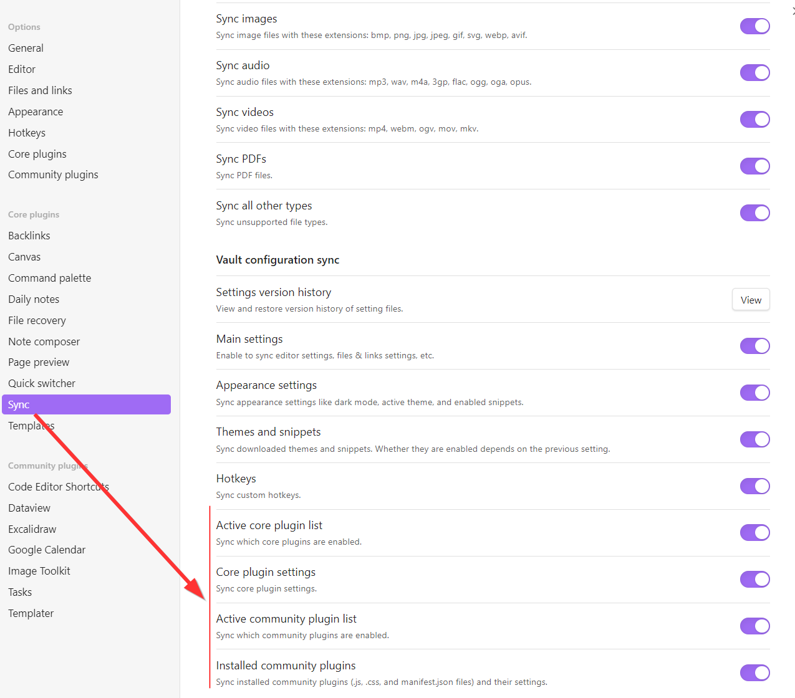
</div>

## How to interconnect your second brain?
A key strength of Obsidian is its flexibility, which makes it a great fit for our malleable first brains. 
Obsidian lets you organize your thoughts in many different ways. 
I encourage you to explore the different options and identify what works for you through learning-and-doing. 
Apart from the traditional nested folder structure of a classical file explorer, you can: 
- create tags to label a note with keywords or topics
- create links to sections inside other notes or also online sources
- embed note parts into other notes to ensure there is only a single source of truth
- define metadata to classify notes
- checkout graph view to find synergies in your notes
These design patterns and their syntax are described in the following subsections. 

### [Tags](https://help.obsidian.md/tags) 
Tags are keywords or topics that help you quickly find the notes you want
- place `#tag_name` before the text you want to label

#### search for tags within target root
You can dynamically search for tags by using below syntax.
This example will show all occurrences of the target tag #standup-comedy  of notes inside the root folder "daily-notes/". 
``` query 
tag:standup-Comedy path:"daily-notes/"
```

##### Use Dataview Plugin 
Use Dataview Plugin for more complex queries. Below an example to show a maximum of 3 notes containing the target tag #grateful, starting with the most recently modified one. This dynamic search is restricted to notes inside the root folder "daily-notes". 
``` dataview
table file.mtime as "Last Modified"
from "daily-notes"
where contains(file.tags, "#grateful")
sort file.mtime desc
limit 3
```

<div>
  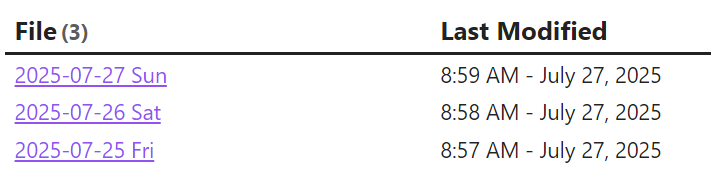
</div>

### [Links](https://help.obsidian.md/links)
Use below syntax to create a link to a file on your computer or also online. 
- `[link_display_text](target_URL)` 

To create a link to another file in your vault (which for me applies to the majority of links I use), you can also use double square brackets (=wikilink).
Pro-Tip: Create 2x`[` left square brackets and let autocomplete create the right brackets for you. 
- `[[filename_to_link]]`

#### [Backlinks](https://help.obsidian.md/plugins/backlinks)
In Obsidian, every note lists backlinks on the bottom right. 
Backlinks let you find all other files which contain links to the current note. 

### [Embed](https://help.obsidian.md/embeds)
To embed notes or only selected note parts into another note (=aka transclusion)
This is very useful to make sure you have a single source of truth. 
- `![[name_of_note#optional_section_inside_note]]`

### [Properties](https://help.obsidian.md/properties)
You can even define metadata by starting a note with 3 dashes `---`. 
Everything above those dashes will be treated as metadata. 

### [Graph View](https://help.obsidian.md/plugins/graph)
Graph view lets you visualize the relationships between your notes. 
In this view, I find it helpful to filter out the daily notes by adding `path: -daily-notes`

<div>
  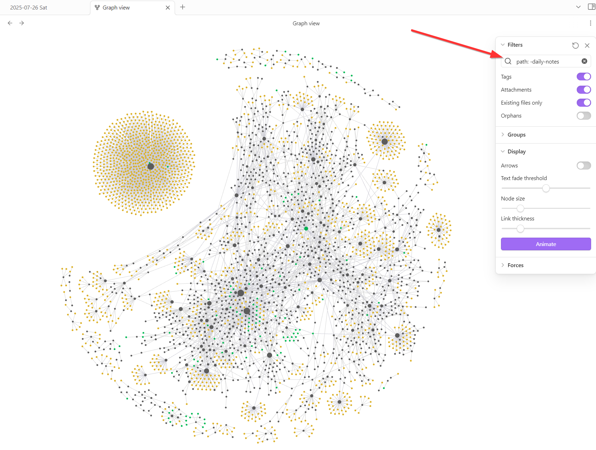
</div>

Easter-egg: The large circular arrangement on the top left are flashcards to learn Portuguese 😅

<div>
  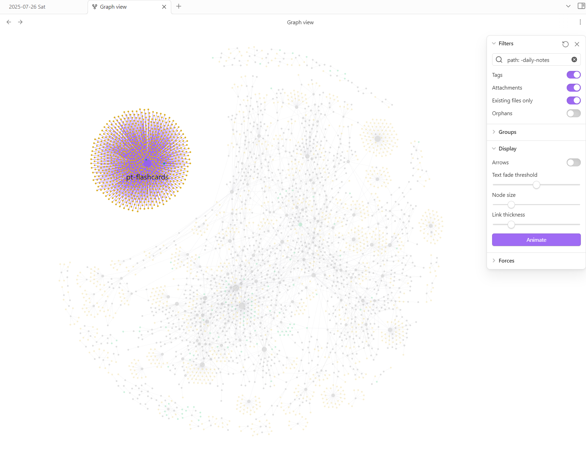
</div>

## How to get overview and navigate within Obsidian?
For me the easiest way to view and navigate are

### between notes
- left panel to navigate to distant notes and get overview
- links to navigate to related notes

### within a note
- right panel to navigate to distant location get overview
- hotkey from `Code Editor Shortcuts` plugin to navigate to previous/next section


## Which Community Plugins are useful?

This chapter lists some Obsidian Community Plugins in alphabetical order, which I found useful for my personal knowledge management through trial and error. 
Each subsection in this chapter mentions a Community Plugin as title and lists its Key Features as bullet points. 

ToDo xxx 
Add examples and how-to for the content still in `quotes`.

### Code Editor Shortcuts
- enables hotkey definition to efficiently navigate between markdown sections (marked with leading `#`) inside a long note

### Dataview
- display open tasks in dynamic lists using custom filters --> see `daily note template`

### Excalidraw
- intuitive freestyle drawing tool
- can include links inside drawing
- can embed drawing note

### Google Calendar
- embedded personal calendar in `daily note template`

### Image Toolkit
- enable zoom and copy of embedded images --> `example screenshots`

### Tasks
- define tasks with deadlines and priorization, e.g. to access via `4 dynamic Eisenhower-lists`

### Templater
- create `dynamic custom links` to connect daily notes
- create `code block template` and `use hotkey to insert` into note
- create `daily note template`

#### plugin usage
- define folder where templates are stored
- in plugin settings under "Template Hotkeys", `define a hotkey to bind to a particular template`

## How to write Obsidian?
This table lists key elements in the markdown-based syntax used in Obsidian. 

| goal                                                        | syntax                                                                                                                                                                            |
| ----------------------------------------------------------- | --------------------------------------------------------------------------------------------------------------------------------------------------------------------------------- |
| create header of target level                               | \- starting a new line with one or several `#`-symbol(s) and adding a ` `space creates a section header<br>\- the more `#`-symbols, the lower its hierarchy level                 |
| create bullet list                                          | start new line with `- ` and hit `Enter` at line end to create new item                                                                                                           |
| create numbered list                                        | start new line with `1. ` and hit `Enter` at line end to create new item                                                                                                          |
| create code block                                           | enclose code with 3 apostrophes (\` ) at code start & end<br>write coding language next to starting apostrophes<br>```python<br>print("The title of this note is", @title)<br>``` |
| convert text to boldface                                    | select target text and type ** to enclose that text with double-stars                                                                                                             |
| create link to any content, can also be outside of Obsidian | [display_name](link_url)                                                                                                                                                          |
| create link to other note in Obsidian                       | [[name_of_other_note]]                                                                                                                                                            |
| create link to section inside other note in Obsidian        | [[name_of_other_note#name_of_section\|display_name_of_section]]                                                                                                                   |
| embed content of one note into another note in Obsidian     | ![embedded_filename#optional_section]                                                                                                                                             |

### How to embed images?
Images can be pasted from the clipboard (Ctrl+C / Ctrl+V) and also accessed by their relative path starting from vault root. 

Ctrl+V will
- create an embedding link `![[Pasted image 20250516084207.png]]`
- store the pasted image in the attachments folder (see [[#Files and Links, Define attachment folder]])

#### use `|width_in_pixels` to set image width
To adjust the display size of an image, you can add `|width_in_pixels` after the filename (`![[Pasted image 20250516084207.png|300]]`). 

<div>
  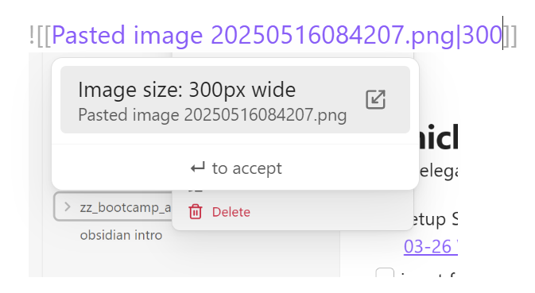
</div>

- Limitation: Images accessed from external url source cannot be rescaled directly into obsidian. 
- Workaround: Since rescaling requires a locally stored image, download or take a screenshot. 

#### use HTML syntax to place multiple images side-by-side

```html
<div>
  
  
</div>
```

<div>
  
  
</div>

### How to create tables?
Obsidian works with both markdown-style and HTML-style tables. 
- markdown tables are easier to adjust but less customizable
- if you need full control, HTML tables are the way to go

#### example markdown-table

| key      | action               |
| -------- | -------------------- |
| Ctrl + , | open settings        |
| Ctrl + P | open command palette |

#### example HTML-table

<table style="width:30%">
  <colgroup>
    <col style="width:40%">
    <col style="width:60%">
  </colgroup>
  <thead>
    <tr>
      <th>key</th>
      <th>action</th>
    </tr>
  </thead>
  <tbody>
    <tr>
      <td>Ctrl + ,</td>
      <td>open settings</td>
    </tr>
    <tr>
      <td>Ctrl + P</td>
      <td>open command palette</td>
    </tr>
  </tbody>
</table>


### How to rearrange your content? 
Once your second brain starts growing, refactoring becomes a topic. 
There are several ways to keep your vault clean. 

#### Rearrange files within your vault

Move file/folder to...

<div>
  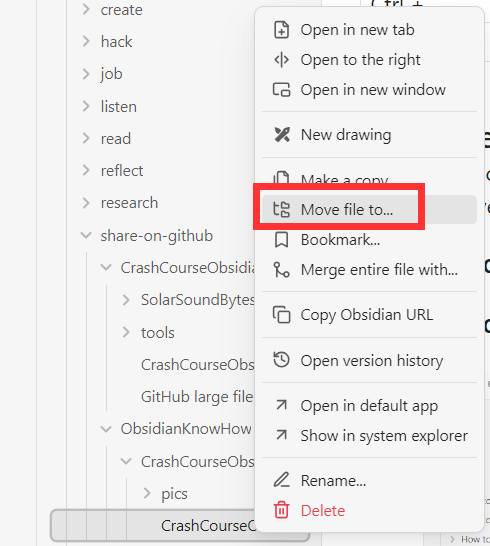
</div>

#### Rearrange sections within a file

Drag and drop sections in right panel (aka in the outline).

![[2025-07-26 10_17_59-Greenshot-cropped.png|300]] ![[2025-07-26 10_18_12-Greenshot-cropped.png|300]]  ![[2025-07-26 10_18_22-Greenshot-cropped.png|300]]

### How to use templates?

#### How to build a template to manually add into a note?

If you use recurring design patterns like for example code blocks, using templates can make your life easier. 

Here's how you can setup a template to create the below python code block.

1. create template file inside template folder

<div>
  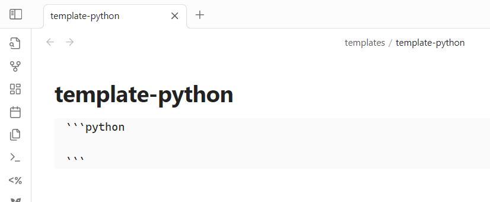
</div>

2. link that template to a custom hotkey

<div>
  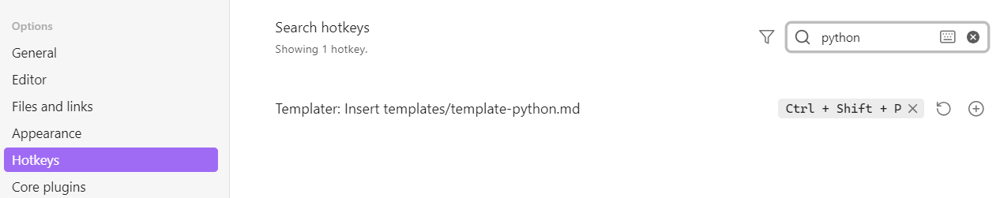
</div>

2. paste template content into current note by using hotkey (Ctrl + Shift + P)
```python
# this empty code block template was created by using a hotkey
```

#### How to build a daily note template?

This section contains sample blocks from my daily note template which could inspire yours as well. 
##### links

While creating a note from a template with Templater code, that code will be converted into its output (=parsed) in that very moment. 

Today for example, the line
- Previous day: [[<% tp.date.now("yyyy-MM-DD ddd", -1) %>]]

was converted into a link to yesterdays daily note
- Previous day: [[2025-07-26 Sat]]

###### greyed out links

Since tomorrows daily note does not exist yet, the line below gets converted into a greyed out link 
- Next day: [[<% tp.date.now("yyyy-MM-DD ddd", 1) %>]]
- Next day: [[2025-07-28 Mon]]

<div>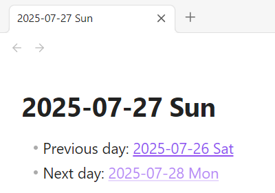</div>

**CAREFUL!!** 
- If you click onto a greyed-out link, you create an empty file with that name (it's a feature, not a bug 🐛). 
- If a file with the exact name of a daily note already exists, obsidian will not create a new one from this daily template.
- So to ensure daily-notes are created based on your template, delete any accidentally pre-created files of the same name. 

##### prioritize
To focus on what is most relevant for you right now, some kind of task prioritization makes sense. 
Inspired by the Eisenhower matrix, I'm using the Tasks plugin to dynamically distribute all tasks into 4 categories. 
Since this prioritization list can get quite long, I'm [[linking to a separate file inside the daily template]]. 

###### How to create tasks inside notes?

The tasks plugin converts the following syntax into checkbox items, which can be toggled between todo/done.
`- [ ] ` becomes <div></div>
`- [x] ` becomes <div></div>

No matter in which note you define a task, it will become part of the dynamic lists shown below - as long as it's marked as `not done`. 
- [ ] a task which is not done has a single empty-space-character inside its checkbox
- [x] a task which is done has a single non-space-character inside its checkbox

To classify tasks you can add parameters
- due date
<div>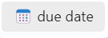</div>
<div></div>
- priority
<div>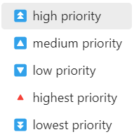</div>

###### urgent and important --> do it
```tasks  
not done  

# urgent
due before tomorrow

# important
priority is high 
```
###### urgent but not important --> delegate it
```tasks  
not done  

# urgent
due before tomorrow

# not important
priority is not high 
``` 
###### important but not urgent --> define it
```tasks  
not done  

# not urgent
due after today
sort by due

# important
(priority is high) OR (priority is highest)
```
###### neither important nor urgent --> drop it
```tasks  
not done  
due after today  
sort by due
short mode  
hide edit button  
hide backlink  
```  


##### journalling

```obsidian
🤗 list placeholder to note what I'm #grateful for today
- 

💩 checkbox placeholder to have fun getting shit done 
- [ ] 
```

##### Google Calendar (advanced)
📢 use plugin "Google Calendar" to include your upcoming events inside the daily note
```gEvent
type: schedule
date: today {{date:YYYY-MM-DD}}  
```

## How to quickly navigate within Obsidian? 
This section contains tips on how to efficiently navigate within Obsidian. 

### How to locate a file?

#### Inside Obsidian
Left-click onto a foldername in top filepath to highlight it inside the tree structure 
<div>
  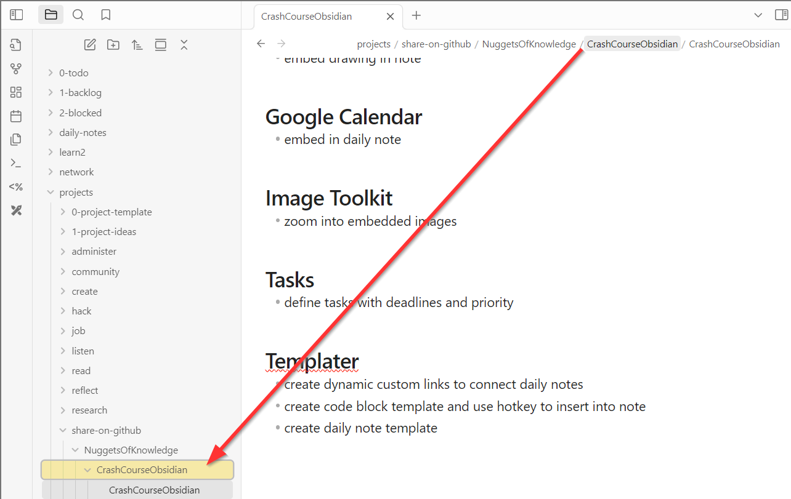
</div>

#### On your local drive
Right click onto a file or folder in tree structure. 
"Show in system explorer" opens the location of that file/folder on your local drive
<div>
  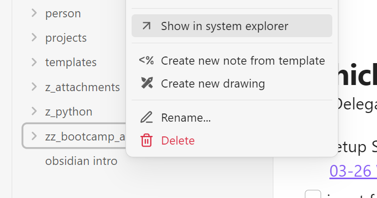
</div>

## Which [Hotkeys](https://help.obsidian.md/hotkeys) are useful?

Obsidian allows you to customize hotkeys, also known as keyboard shortcuts.
This section lists the hotkeys I am using in Obsidian. 
Some of the hotkeys were customized as shown below.

### Create

| action                                                                                                                  | shortcut    |
| ----------------------------------------------------------------------------------------------------------------------- | ----------- |
| extract heading = create separate file to refactor obsidian                                                             | Ctrl + F1   |
| extract this heading<br>\- navigate to a `# section_title`<br>\- extract = create new file from content in this section | Ctrl + F1   |
| insert markdown link<br>\- pro tip: highlight text first to quickly create a link                                       | Ctrl + K    |
| open context menu by simulating right-mouse-click<br>\- e.g. to add column to table without using mouse                 | Shift + F10 |
| toggle checkbox on/off<br>\- switching between (un-)ticked checkbox <br>`- [ ] `<br>`- [x] `                            | Ctrl + Y    |

### Edit

| action                                                                                | shortcut         |
| ------------------------------------------------------------------------------------- | ---------------- |
| move current note into different folder                                               | Ctrl + Shift + M |
| paste without format                                                                  | Ctrl + Shift + V |
| rename current note --> this automatically updates any links pointing to that note 💌 | F2               |
| switch editor/read mode                                                               | Ctrl + E         |

### Navigate

| action                                                                  | shortcut                |
| ----------------------------------------------------------------------- | ----------------------- |
| exit side pane to center note pane                                      | Esc                     |
| follow link                                                             | Ctrl + Enter            |
| go backward                                                             | Ctrl + Alt + Left       |
| go forward                                                              | Ctrl + Alt + Right      |
| go to next/previous heading (enabled by plugin "Code Editor Shortcuts") | Alt + arrow up/down     |
| go to previous/next tab                                                 | Ctrl + (Shift) + Tab    |
| meta-hotkey to quickly get to hotkey settings 🚀                        | Ctrl + ,                |
| navigate to previous/next tab                                           | Ctrl + Alt + left/right |
| open command palette                                                    | Ctrl + P                |
| open daily note                                                         | Alt + O                 |
| open link under cursor to the right                                     | Ctrl + Alt + Enter      |
| open new tab                                                            | Ctrl + T                |
| open pane left, files                                                   | Alt + J                 |
| open pane right, outline                                                | Alt + K                 |
| undo close tab (reopen last closed tab)                                 | Ctrl + Shift + T        |

### Search

| action                           | shortcut         |
| -------------------------------- | ---------------- |
| search & replace in current file | Ctrl + H         |
| search in all files              | Ctrl + Shift + F |
| search in current file           | Ctrl + F         |

### Templates

| action                                                                         | shortcut         |
| ------------------------------------------------------------------------------ | ---------------- |
| create new note from template                                                  | Alt + N          |
| insert template into current note --> choose from list                         | Alt + I          |
| insert template into current note --> specific file, e.g. `template-python.md` | Ctrl + Shift + P |

### View

| action                                                                                                  | shortcut                         |
| ------------------------------------------------------------------------------------------------------- | -------------------------------- |
| open file navigation on the left                                                                        | Alt + J                          |
| open file navigation on the left and highlight current file<br>Files: Reveal current file in navigation | Alt + F                          |
| open file, aka quick switcher                                                                           | Ctrl + O                         |
| open graph view                                                                                         | Ctrl + G                         |
| open graph view                                                                                         | Ctrl + G                         |
| open settings                                                                                           | Ctrl + ,(comma)                  |
| toggle console on/off                                                                                   | Ctrl + Shift + I                 |
| toggle left/right sidebar on/off                                                                        | Ctrl + (Shift) + \`(=apostrophe) |

### How to customize your hotkeys?

To increase your productivity in Obsidian, I recommend you create hotkeys to streamline your personal knowledge management. 
To customize hotkeys, navigate to Settings (gear symbol on bottom left) and select Hotkeys. 

<div>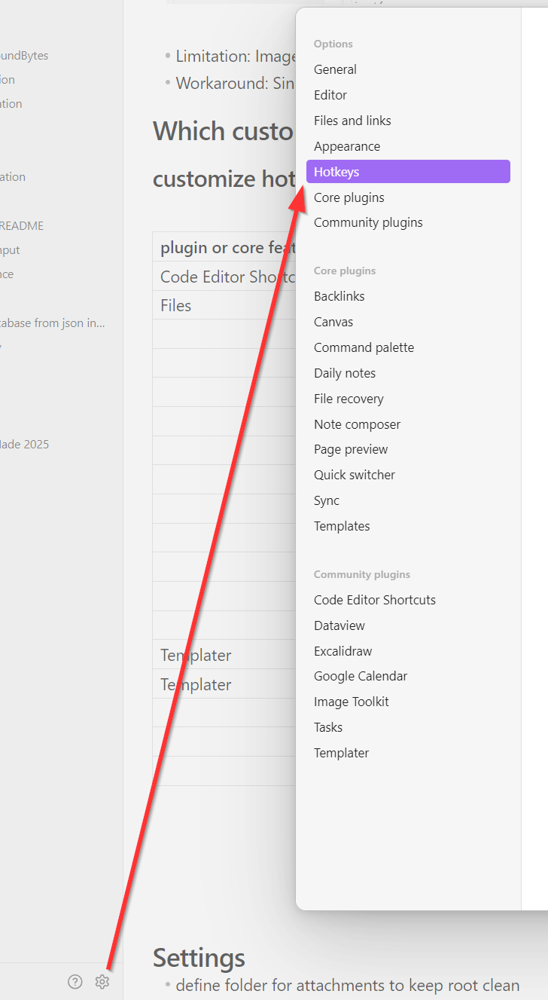</div>

#### List of customized hotkeys and their label to search in settings

This is a list of all the hotkeys I customized. 

| Label in Settings                                  | Shortcut                       |
| -------------------------------------------------- | ------------------------------ |
| Extract Heading (Note Composer)                    | Ctrl + F1                      |
| Go Back                                            | Alt + Ctrl + ArrowLeft         |
| Go Forward                                         | Alt + Ctrl + ArrowRight        |
| Go to Next Heading (Obsidian Editor Shortcuts)     | Alt + ArrowDown                |
| Go to Previous Heading (Obsidian Editor Shortcuts) | Alt + ArrowUp                  |
| Insert Template                                    | Alt + I                        |
| Move File (File Explorer)                          | Ctrl + Shift + M               |
| Open Daily Notes                                   | Alt + O                        |
| Open File Explorer                                 | Alt + J                        |
| Open Outline                                       | Alt + K                        |
| Open Outline for Current                           | Ctrl + Shift + \`(=apostrophe) |
| Reveal Active File (File Explorer)                 | Alt + F                        |
| Run All Code Blocks in File (Execute Code)         | Ctrl + R                       |
| Show Find and Replace (Text Finder)                | Ctrl + Shift + H               |
| Template: Python (Templater-Obsidian)              | Ctrl + Shift + P               |
| Template: Shell (Templater-Obsidian)               | Ctrl + Shift + S               |
| Template: Task Cancelled (Templater-Obsidian)      | Alt + Y                        |
| Toggle Done (Obsidian Tasks Plugin)                | Ctrl + Y                       |
| Toggle Left Sidebar                                | Ctrl + \`(=apostrophe)         |
| Toggle Right Sidebar                               | Ctrl + Shift + \`(=apostrophe) |

