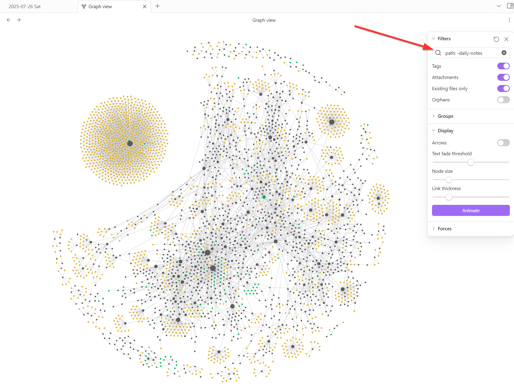

# How to interconnect your second brain?
A key strength of Obsidian is its flexibility, which makes it a great fit for our malleable first brains. 
Obsidian lets you organize your thoughts in many different ways. 
I encourage you to explore the different options and identify what works for you through learning-and-doing. 
Apart from the traditional nested folder structure of a classical file explorer, you can: 
- create tags to label a note with keywords or topics
- create links to sections inside other notes or also online sources
- embed note parts into other notes to ensure there is only a single source of truth
- define metadata to classify notes
- checkout graph view to find synergies in your notes
These design patterns and their syntax are described in the following subsections. 

## [Tags](https://help.obsidian.md/tags) 
Tags are keywords or topics that help you quickly find the notes you want
- place `#tag_name` before the text you want to label

### search for tags within target root
You can dynamically search for tags by using below syntax.
This example will show all occurrences of the target tag #standup-comedy  of notes inside the root folder "daily-notes/". 
``` query 
tag:standup-Comedy path:"daily-notes/"
```

#### Use Dataview Plugin 
Use Dataview Plugin for more complex queries. Below an example to show a maximum of 3 notes containing the target tag #grateful, starting with the most recently modified one. This dynamic search is restricted to notes inside the root folder "daily-notes". 
``` dataview
table file.mtime as "Last Modified"
from "daily-notes"
where contains(file.tags, "#grateful")
sort file.mtime desc
limit 3
```

<div>
  
</div>

## [Links](https://help.obsidian.md/links)
Use below syntax to create a link to a file on your computer or also online. 
- `[link_display_text](target_URL)` 

To create a link to another file in your vault (which for me applies to the majority of links I use), you can also use double square brackets (=wikilink).
Pro-Tip: Create 2x`[` left square brackets and let autocomplete create the right brackets for you. 
- `[[filename_to_link]]`

### [Backlinks](https://help.obsidian.md/plugins/backlinks)
In Obsidian, every note lists backlinks on the bottom right. 
Backlinks let you find all other files which contain links to the current note. 

## [Embed](https://help.obsidian.md/embeds)
To embed notes or only selected note parts into another note (=aka transclusion)
This is very useful to make sure you have a single source of truth. 
- `![[name_of_note#optional_section_inside_note]]`

## [Properties](https://help.obsidian.md/properties)
You can even define metadata by starting a note with 3 dashes `---`. 
Everything above those dashes will be treated as metadata. 

## [Graph View](https://help.obsidian.md/plugins/graph)
Graph view lets you visualize the relationships between your notes. 
In this view, I find it helpful to filter out the daily notes by adding `path: -daily-notes`

<div>
  
</div>

### 🥚 Easter-egg

The large circular arrangement on the top left are [Anki](https://apps.ankiweb.net/) flashcards defined in a single humongous note to learn Brazilian Portuguese 😅

<div>
  
</div> 