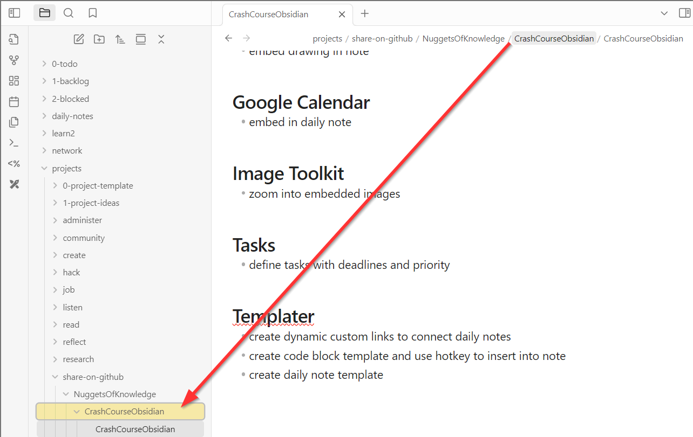
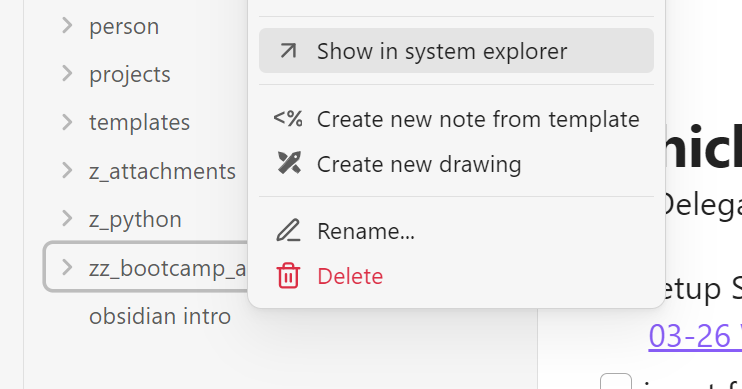

# How to quickly navigate within Obsidian? 
This section contains tips on how to efficiently navigate within Obsidian. 

## How to locate a file?

### Inside Obsidian
Left-click onto a foldername in top filepath to highlight it inside the tree structure 

  

### On your local drive
Right click onto a file or folder in tree structure. 
"Show in system explorer" opens the location of that file/folder on your local drive

  

 