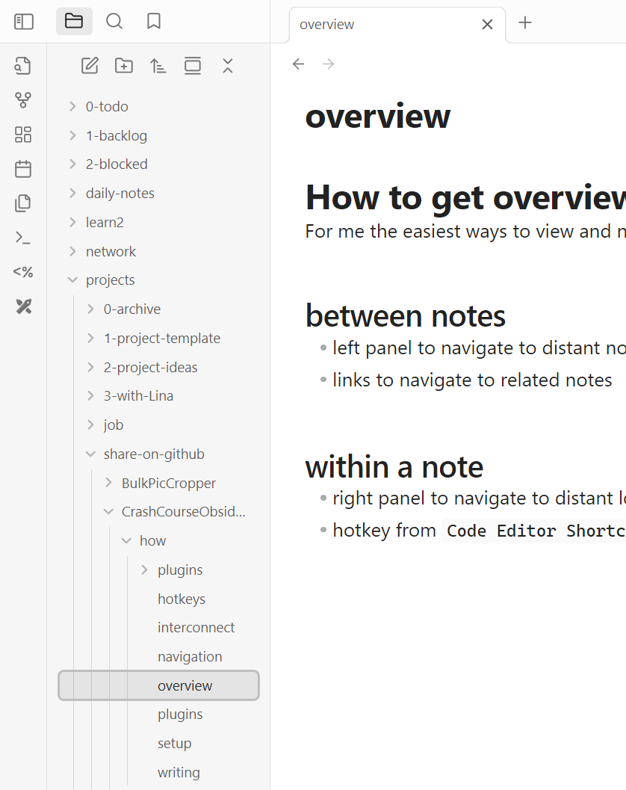
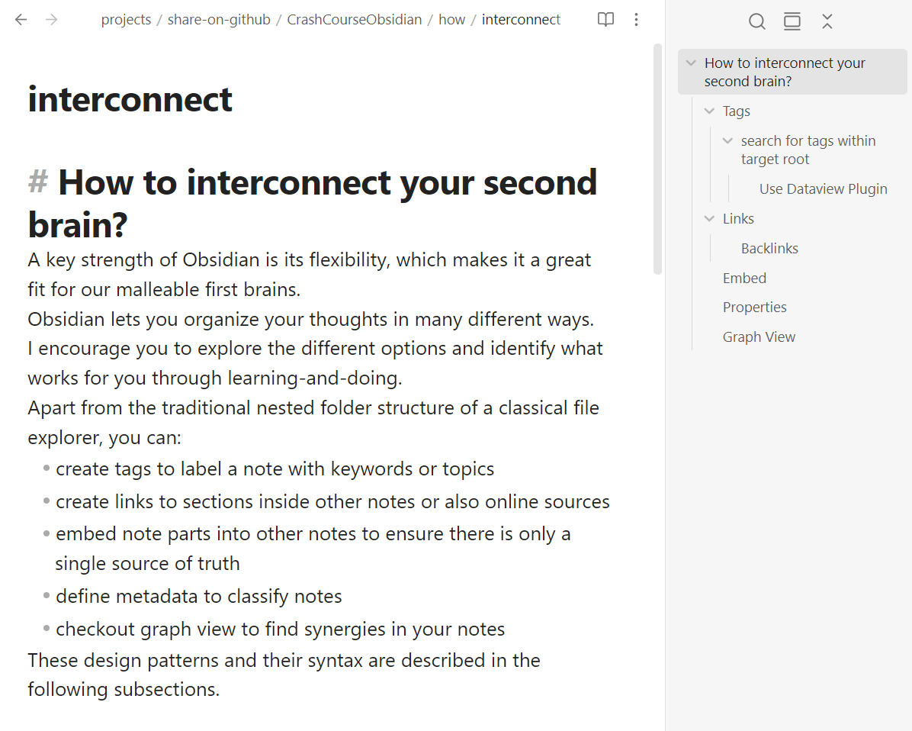

# How to get overview and navigate within Obsidian?
For me the easiest ways to view and navigate are

## between notes
- left panel to navigate to distant notes and get overview
- links to navigate to [related notes](plugins.md)

## within a note
- right panel to navigate to distant location get overview
- hotkey from `Code Editor Shortcuts` plugin to navigate to previous/next section 

