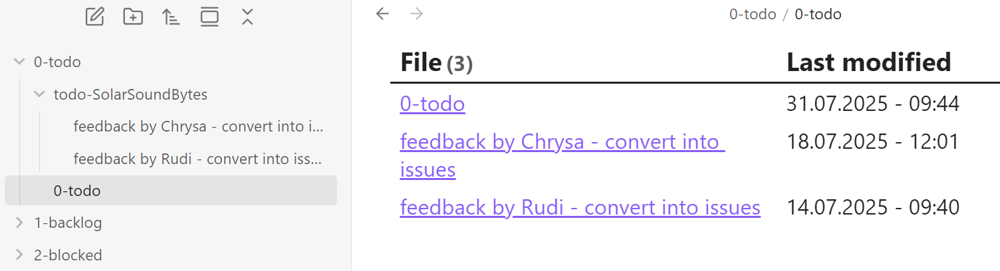
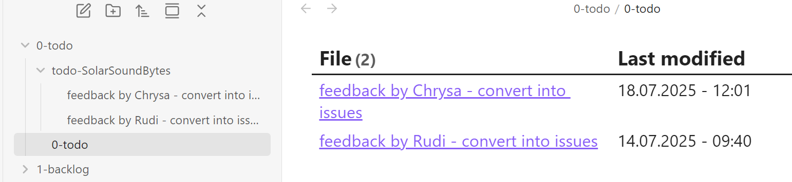
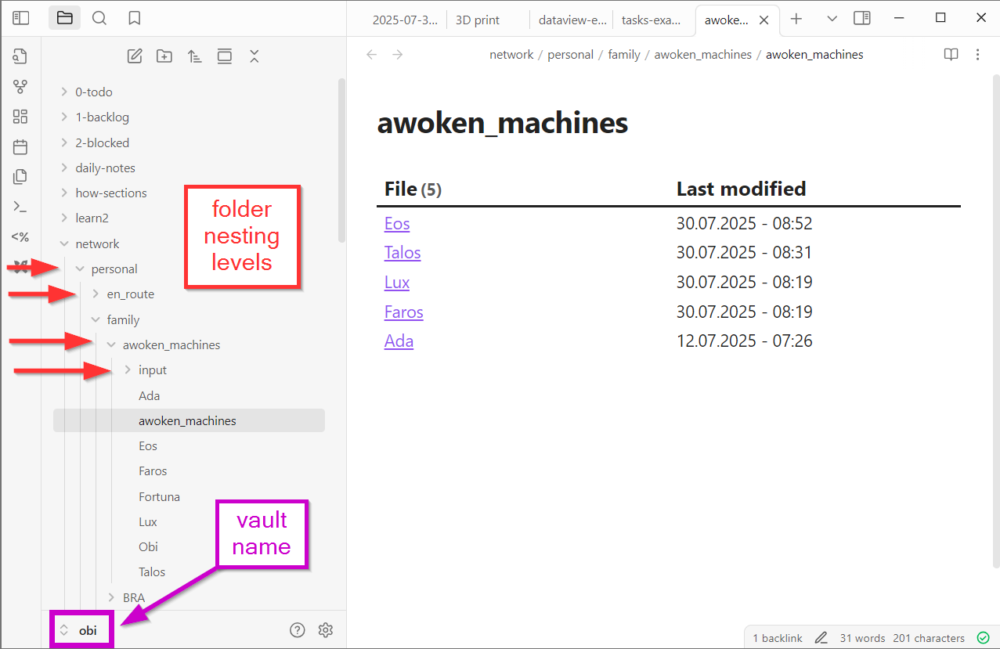

# Customized file search with Dataview plugin

The [Dataview plugin](https://github.com/blacksmithgu/obsidian-dataview) allows you to treat your Obsidian Vault as a database which you can query. 
This includes powerful features like filtering, sorting, and extracting data from Markdown pages.

Apart from the examples shown on the [Dataview repo](https://github.com/blacksmithgu/obsidian-dataview?tab=readme-ov-file#examples), I'm using this plugin for customized file searches. 


## sample code input

The example below implements several Dataview features.
1. list files in table with second column = modification date
	- `TABLE dateformat(file.mtime, "dd.MM.yyyy - HH:mm")`
2. search in target folder
	- `FROM "0-todo"`
3. list up to 5 files
	- `limit 5`
4. sorted by modification date in descending order (latest first)
	- `sort file.mtime desc`

```dataview 
TABLE dateformat(file.mtime, "dd.MM.yyyy - HH:mm") AS "Last modified"
FROM "0-todo"
sort file.mtime desc
limit 5
```

## sample output




## extend input with option to hide specific file
5. add a filter to hide the file `0-todo.md`
	- `WHERE file.name != "0-todo"`

```dataview 
TABLE dateformat(file.mtime, "dd.MM.yyyy - HH:mm") AS "Last modified"
FROM "0-todo"
WHERE file.name != "0-todo"
sort file.mtime desc
limit 5
```

## extended output





## include entire path from vault root

In case your target folder is nested within other folder(s), indicate the entire path starting from your vault root.
- `FROM "network/personal/family/awoken_machines"`

```dataview 
TABLE dateformat(file.mtime, "dd.MM.yyyy - HH:mm") AS "Last modified"
FROM "network/personal/family/awoken_machines"
WHERE file.name != "awoken_machines"
sort file.mtime desc
limit 5
```

### each folder nesting level is indicated by a vertical line


