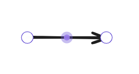

Excalidraw is an amazingly flexible drawing tool 💖
I'm a big fan of its flexibility and intuitive user experience. 
The examples below illustrate different drawing features in action. 

# create drawing elements 

to quickly create elements, 
- either type the associated number
  
- or the assigned letter (e.g. R for Rectangle)
  hovering over a symbol reveals the assigned letter
  


# insert image
- use Ctrl+V to paste images into an Excalidraw drawing
- to modify a pasted image (e.g. rename or move to another location) just right-click inside drawing and select "Open Link"


## pasted image

file of any file is shown on top center location


# selecting any element opens sidebar to modify:
- Stroke = choose color
- Font family
- Font size
- Text align
- Opacity --> make element partially transparent
- Layers --> how to arrange content if image elements overlap each other
- Actions = copy, delete, link


## different color


# lines and arrows can be customized

- select "Arrowheads" to change beginning and end of arrow
- deform by dragging mid-point --> new sub-sections with new midpoints created --> can further deform


## evolution of an arrow
<table style="border-collapse: collapse;">
  <tr>
    <td style="border: 1px solid black; text-align: center; vertical-align: top;">
      <span style="font-size: 1.25em; font-weight: bold; display: block; margin-bottom: 0.5em;">step 1</span>
      
    </td>
    <td style="border: 1px solid black; text-align: center; vertical-align: top;">
      <span style="font-size: 1.25em; font-weight: bold; display: block; margin-bottom: 0.5em;">step 2</span>
      
    </td>
  </tr>
  <tr>
    <td style="border: 1px solid black; text-align: center; vertical-align: top;">
      <span style="font-size: 1.25em; font-weight: bold; display: block; margin-bottom: 0.5em;">step 3</span>
      
    </td>
    <td style="border: 1px solid black; text-align: center; vertical-align: top;">
      <span style="font-size: 1.25em; font-weight: bold; display: block; margin-bottom: 0.5em;">step 4</span>
      
    </td>
  </tr>
</table>


# insert link

1. highlight / select any element
2. click onto "link" symbol (or use hotkey to insert link)


3. type link into input field above element


4. example link to other note


5. non-selected element with link has link-symbol on top right corner


## following link opens new tab

left-click onto link-symbol to follow link --> this opens link target in new tab


### Maybe you noticed: The same file is now open multiple times

Use "Split right" to work on different sections within the same file 😉


This layout arrangement can be useful when working on a note which is too long for your display. 


# export entire drawing to svg

I recommend working with SVG = scalable vector graphics. 
No matter how small or large, the image will always be of perfect quality (no pixelation by zoom). 

To export your drawing, select the 3 dots on the top right and select "Export Image". 


Then select "Export SVG" in the popup window. 


# Several SVG files can be combined into a single note using HTML (advanced)

```html
<div style="display: flex; gap: 12px; align-items: flex-start;">
  
  
</div>
```

<div style="display: flex; gap: 12px; align-items: flex-start;">
  
  
</div>
