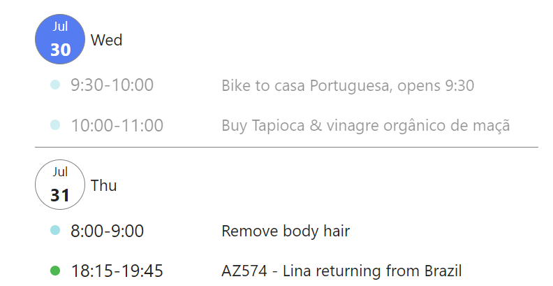

# Google Calendar Plugin

Following the online [documentation](https://yukigasai.github.io/obsidian-google-calendar/Setup), you can include chosen parts of your google calendar into an obsidian note. 

This is an advanced feature, requiring you to create a project on Google Colab. 

## Include upcoming calendar events into daily note using Templater

```gEvent
type: schedule
date: today {{date:YYYY-MM-DD}}  
```

Upon note creation, Templater converts above input code into below ouptut code. 
See the [Templater example](./templater-examples.md) for more details on using Templater in Obsidian.


```gEvent
type: schedule
date: today 2025-07-31  
```

After setting up Google Calendar Plugin, this output code generates a list of events, starting from the target date (i.e. today). 

Greyed out content is already in the past. 




