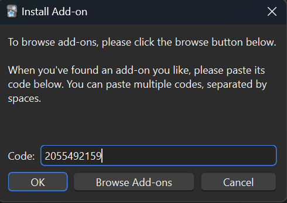

# How to enable Anki Flashcards inside Obsidian?

[Anki](https://apps.ankiweb.net/) is an open-source software to learn flashcards using spaced repetition. 

The [Obsidian to Anki plugin](https://github.com/ObsidianToAnki/Obsidian_to_Anki) allows you to export your Obsidian notes directly to Anki flashcards.

This plugin is particularly useful for students and lifelong learners who want to combine their note-taking with their memory training workflow. 

## Key Features

- Convert Obsidian notes to Anki flashcards in bulk
- Maintain links and formatting when exporting
- Customizable card templates

For detailed examples and configuration options, refer to the [plugin documentation](https://github.com/ObsidianToAnki/Obsidian_to_Anki/wiki) and [community discussions](https://github.com/ObsidianToAnki/Obsidian_to_Anki/discussions).


# Initial setup

## AnkiWeb program

1. [Download](https://apps.ankiweb.net/) and install the AnkiWeb software on your computer. 
2. Get your ID and password from the website [AnkiWeb.net](https://ankiweb.net/decks)
 
## Activate the plugin Obsidian_to_Anki inside Obsidian


## [AnkiConnect](https://git.foosoft.net/alex/anki-connect)


## setup AnkiApp


### code = 2055492159




## verify AnkiConnect is running

Anki-Connect runs a local HTTP server in order to enable other applications to connect to it. 

The host application, Anki, must be unblocked for this plugin to function correctly.

[open localhost:8765](http://localhost:8765)


## Extend Plugin with Regex to allow for several #flashcard sections inside single note

search term = "#flashcard"

```regex
((?:[^\n][\n]?)+) #flashcard ?\n*((?:\n(?:^.{1,3}$|^.{4}(?<!<!--).*))+)
```


# create Anki flashcards in Obsidian

## add card

```flashcard-example
front page 
#flashcard 
back page
one paragraph
without space

new card
```

## remove card

```flashcard-example
front page
#flashcard 
back page
DELETE
```

## scan vault to update Anki

1. Run the Anki software on your computer
2. Use Obsidian_to_Anki to scan your vault for new flashcards
3. Any new `#flashcards` will be given an ID and imported into AnkiWeb


# Verify that your new flashcards were added to AnkiWeb


## each `#flashcard` was given an ID, looking good!


## open your deck


## search for sample card


## sample card added 🚀


