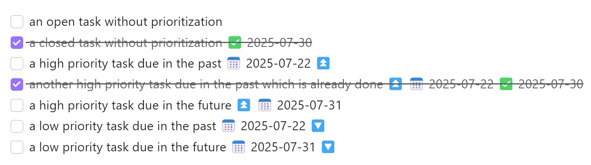
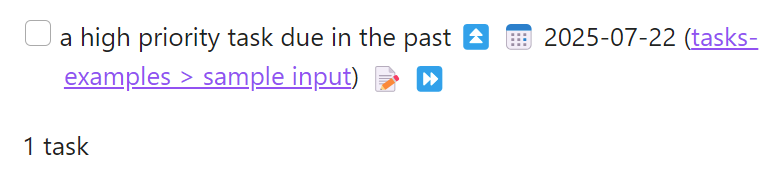
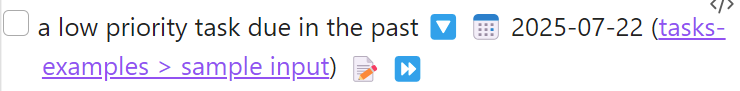
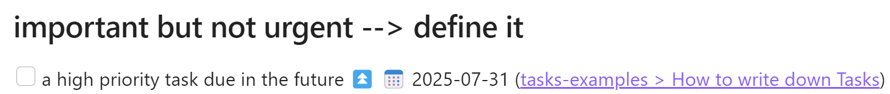
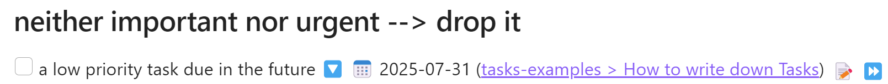

# Why use [Tasks](https://publish.obsidian.md/tasks/Reference/Task+Formats/About+Task+Formats)?

A key role of Obsidian as your second brain is it's ability to deal with messy input data. 
That's where the Tasks-plugin shines 😄

Whenever I think about a task, I just write it into whatever note I am currently working on. 
Afterwards, I can then review all open tasks from all notes inside of my Obsidian vault by checking Eisenhower-style lists (see below). 

So whenever you think about something to do, just write it down to free up your mind. 

No matter which note you are currently working on, Obsidian will take care of keeping track of your tasks. 💞

## How to write down Tasks

This section shows you example tasks in Obsidian. 

- [ ] an open task without prioritization
- [x] a closed task without prioritization ✅ 2025-07-30
- [ ] a high priority task due in the past 📅 2025-07-22 ⏫ 
- [x] another high priority task due in the past which is already done ⏫ 📅 2025-07-22 ✅ 2025-07-30
- [ ] a high priority task due in the future ⏫ 📅 2025-07-31
- [ ] a low priority task due in the past 📅 2025-07-22 🔽 
- [ ] a low priority task due in the future 📅 2025-07-31 🔽 

### sample output



# arrange tasks into Eisenhower groups

To automatically group tasks into the 4 quadrants of an [Eisenhower-style prioritization matrix](https://en.wikipedia.org/wiki/Time_management#Eisenhower_method), you can use dynamic lists shown below. 
Sample ouptut was generated on 2025-07-30. 

## urgent and important --> do it
```tasks  
not done  

# urgent
due before tomorrow

# important
priority is high 
```

### sample output



## urgent but not important --> delegate it
```tasks  
not done  

# urgent
due before tomorrow

# not important
priority is not high 
``` 

### sample output




## important but not urgent --> define it
```tasks  
not done  

# not urgent
due after today
sort by due

# important
priority is high
```

### sample output




## neither important nor urgent --> drop it
```tasks  
not done  

# not urgent
due after today
sort by due

# not important
priority is not high 
``` 

### sample output




## option to enable short mode

```tasks  
not done  
short mode  

# not urgent
due after today
sort by due

# not important
priority is not high 
``` 

### sample output


## option to hide edit button and backlink
```tasks  
not done  
short mode  

# not urgent
due after today
sort by due

# not important
priority is not high 

hide edit button  
hide backlink  
```  

### sample output


