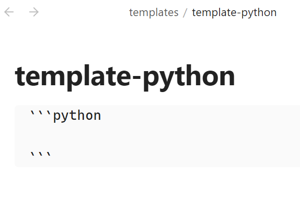
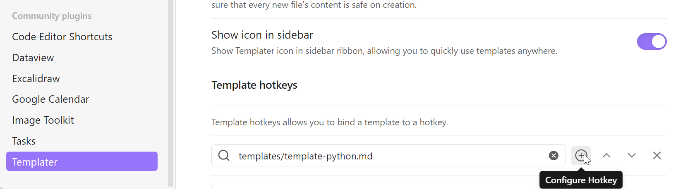
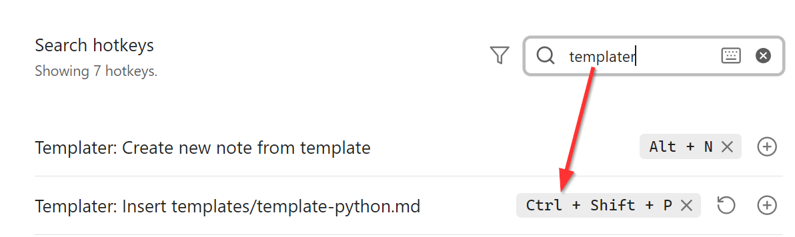
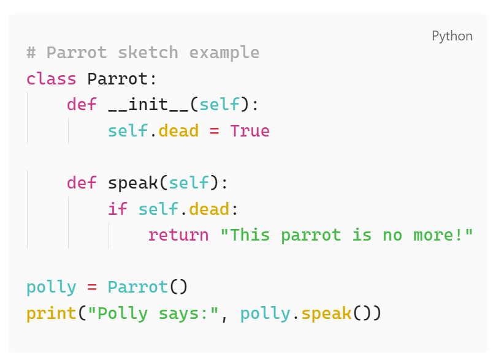

# previous/next day

In my template-daily-note I use the [Templater](https://silentvoid13.github.io/Templater/) plugin to dynamically create links to the next and previous day. 

## template input
- Previous day: `[[<% tp.date.now("yyyy-MM-DD ddd", -1) %>]]`
- Next day: `[[<% tp.date.now("yyyy-MM-DD ddd", 1) %>]]`

## output on 2025-07-30
- Previous day: [[2025-07-29 Tue]]
- Next day: [[2025-07-31 Thu]]


# insert custom text block using hotkey

You can define your favorite text block and conveniently insert that by using a custom hotkey 🥳

## define template



## define hotkey

- configure hotkey for target template


- define hotkey


## 🥚 another easter egg

```python

```

Using the hotkey `Ctrl + Shift + P` I just inserted the text block above to display some python code.

```python
# Parrot sketch example
class Parrot:
    def __init__(self):
        self.dead = True

    def speak(self):
        if self.dead:
            return "This parrot is no more!"

polly = Parrot()
print("Polly says:", polly.speak())
```




