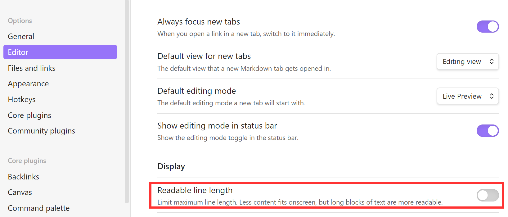
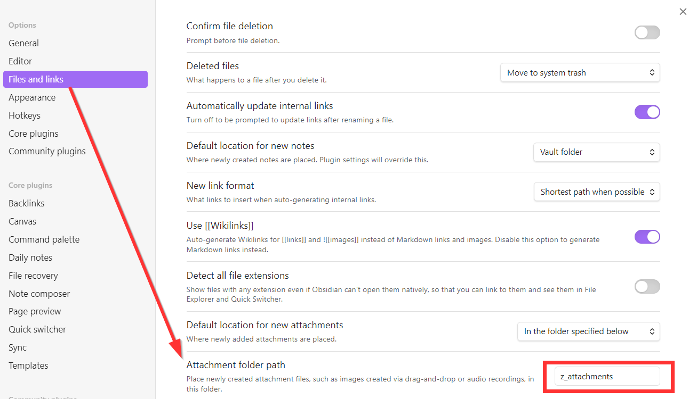
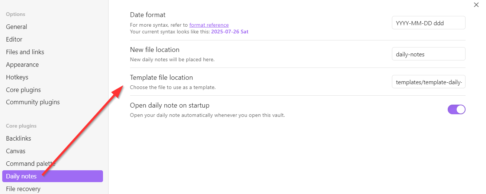
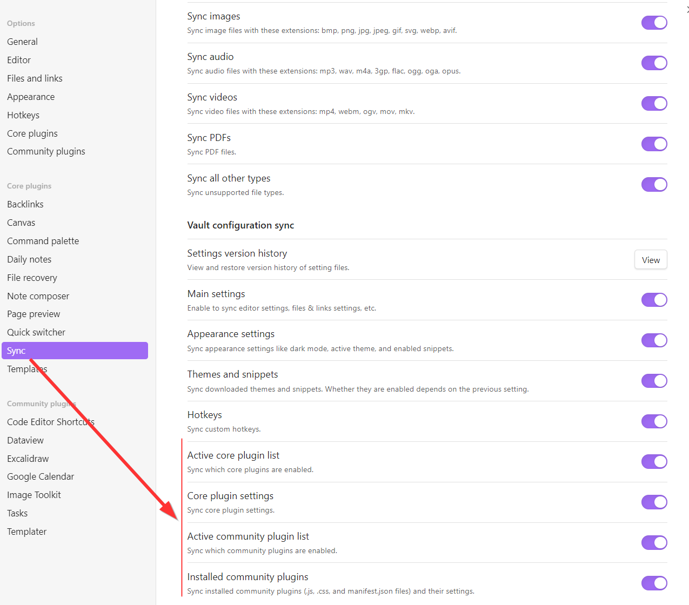
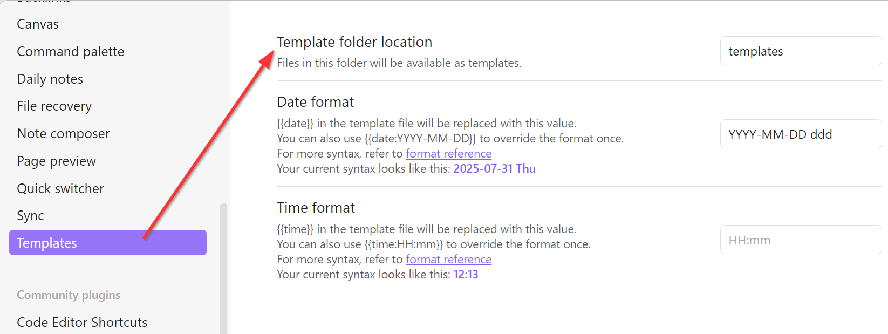

# How to setup Obsidian?

## [Download and install Obsidian](https://obsidian.md/download)
- cross-platform, available for 
  - mobile (iOS, Android), and 
  - desktop (Windows, Mac, Linux)
- during installation, define the local path to your Obsidian vault

## Settings
Obsidian is highly customizable. 
Here are the settings-changes I find useful. 

### Editor, set compact view
By default, the note editor window shows a lot of empty space on the left and right side. 
To get a quicker overview of a note, I prefer a more compact view. 
To remove this white space, go to Settings > Editor and turn off the field labeled "Readable line length". 

  

### Files and Links, define attachment folder
By default, every new image you paste into a note will be copied as attachment into the root vault folder, which leads to clutter. 
So before starting to paste images into your notes, it makes sense to define a dedicated folder where new attachments will be automatically stored. 

  

### Daily notes, define format and locations
To use Obsidian as a journal, define
- Date format
	- how to label the current-daily-note
- New file location
	- where to store the current-daily-note
- Template file location
	- template on which to base current-daily-note on
- Open daily note on startup
	- I turned this on

  

### Sync, turn on for plugins
I'm using Obsidian on my laptop and also on my phone. 
This lets me take notes on the go and refactor them later by using a keyboard. 
To ensure there are no synchronization errors, I turned on plugin synchronization. 

  

 

### Templates, define folder location

  

 

