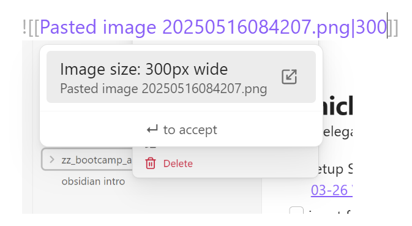
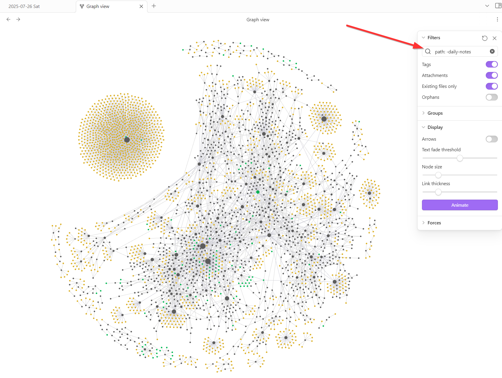
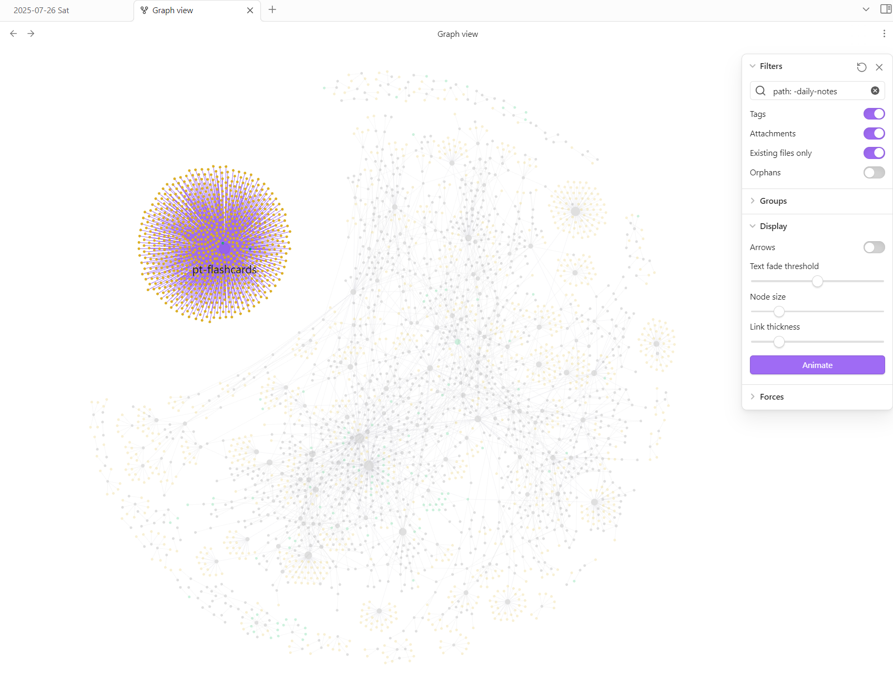

# How to embed images?
Images can be pasted from the clipboard (Ctrl+C / Ctrl+V) and also accessed by their relative path starting from vault root. 

Ctrl+V will
1. create an embedding link `![[Pasted image 20250516084207.png]]` and
2. store that pasted image in the attachments folder (see setup section on [Files and Links, Define attachment folder](../setup.md#files-and-links-define-attachment-folder))

## Use `|width_in_pixels` to set image width
- To adjust the display size of an image, you can add `|width_in_pixels` after the filename: 
- `![[Pasted image 20250516084207.png|300]]`

<div>
  
</div>

### Limitation and Workaround

- Limitation: Images accessed from an external URL cannot be rescaled directly into Obsidian
- Workaround: Since rescaling requires a locally stored image, download or screenshot the target image and paste it into Obsidian. 

## use HTML syntax to place multiple width-scaled images side-by-side

```html
<div>
  
  
</div>
```

<div>
  
  
</div>


