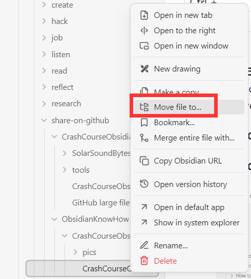
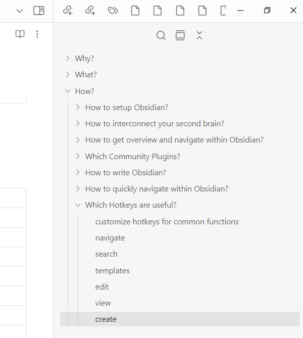
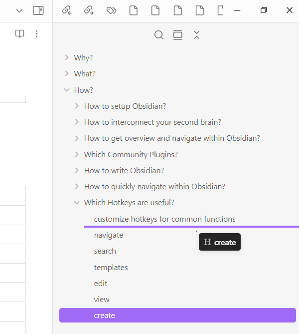
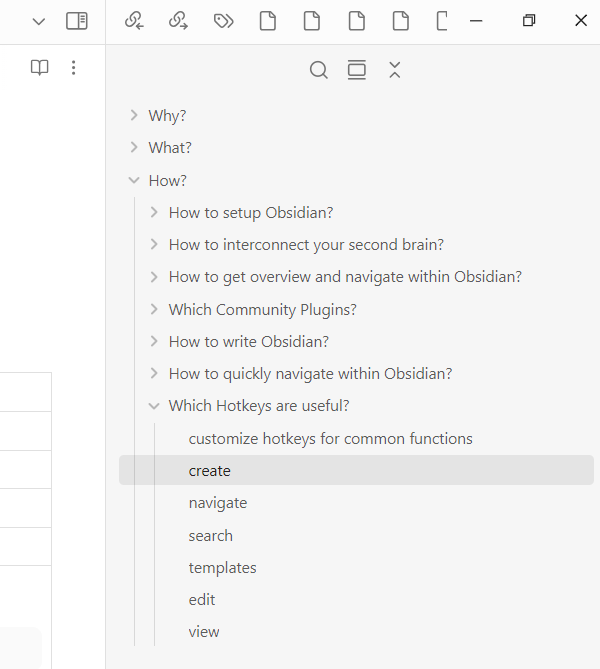

# How to rearrange your content? 
Once your second brain starts growing, refactoring becomes a topic. 
There are several ways to keep your vault clean. 

## Rearrange files within your vault

Move file/folder to...

  

## Rearrange sections within a file

Drag and drop sections in right panel (aka in the outline).

<table style="border-collapse: collapse;">
  <tr>
    <td style="border: 1px solid black; text-align: center;">
      
Step 1

      
    </td>
    <td style="border: 1px solid black; text-align: center;">
      
Step 2

      
    </td>
    <td style="border: 1px solid black; text-align: center;">
      
Step 3

      
    </td>
  </tr>
</table>