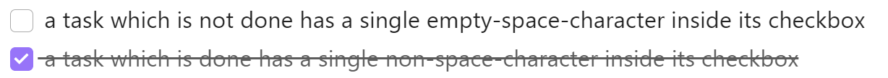
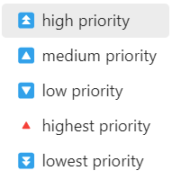

# How to create tasks inside notes?

## checkbox items

The tasks plugin converts the following syntax into checkbox items, which can be toggled between `not done` and `done`.

- `not done` checkbox
    - starting a line with `- [ ] `
    - displayed as 

- `done` checkbox 
    - starting a line with `- [x] `
    - displayed as 

Hint: Checkbox items must include an empty space-character at the end. 

## done vs. not done

No matter in which note you define a task, it will become part of the dynamic lists shown <a href="../plugins/tasks-examples.md#arrange-tasks-into-eisenhower-groups">here</a> - as long as it's marked as `not done`. 

- [ ] a task which is not done has a single empty-space-character inside its checkbox
- [x] a task which is done has a single non-space-character inside its checkbox

### sample output

## classify tasks

To classify tasks you can add the parameters `due date` and `priority`

### due date

### priority

