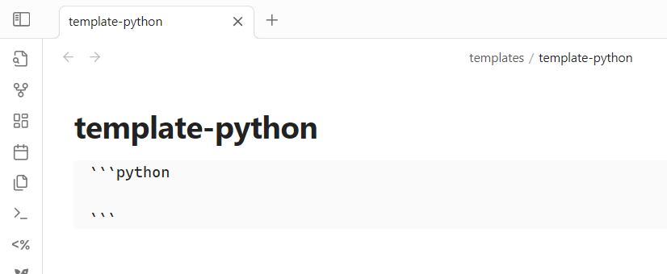
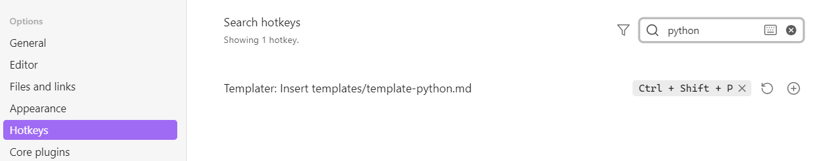
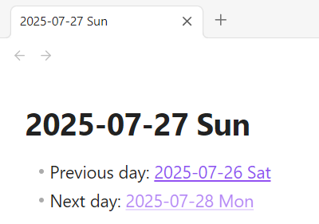

# How to use templates?

## How to build a template to manually add into a note?

If you use recurring design patterns like for example code blocks, using templates can make your life easier. 

Here's how you can setup a template to create the below python code block.

1. create template file inside template folder

<div>
  
</div>

2. link template to a custom hotkey

<div>
  
</div>

3. paste template content into current note by using hotkey `(Ctrl + Shift + P)`
```python
# this empty code block template was created by using a hotkey
```

## How to build a daily note template?

This section contains sample blocks from my daily note template which could inspire yours as well. 
### Add dynamic links

While creating a note from a template, the <a href="../plugins/templater-examples.md">Templater-plugin</a>-style-code will be converted into its output (=parsed) in that very moment. 

For example, on 2025-07-27 Sun, the line
- Previous day: `[[<% tp.date.now("yyyy-MM-DD ddd", -1) %>]]`

was converted into a link to the associated daily note. 
- Previous day: [[2025-07-26 Sat]]

### greyed out links

Since tomorrows daily note does not exist today, the "Next day"-link is a greyed out upon creation. 

As soon as the next day starts, that note will be created with the next startup of Obsidian. 

- Next day: `[[<% tp.date.now("yyyy-MM-DD ddd", 1) %>]]`
- Next day: [[2025-07-28 Mon]]

#### sample output

<div></div>

#### **CAREFUL with greyed-out links!!** 
- If you click onto a greyed-out link, Obsidian will create an empty file with that name in the root folder (it's a feature, not a bug 🐛). 
- If a file with the exact same name of a your target daily note template already exists, Obsidian will not create a new daily note. This makes sense so you don't accidentally overwrite an existing daily note if you start Obsidian more than once a day.
- So to ensure daily-notes are created based on your template, delete any accidentally pre-created files of that same day-name. 
- Also, it's good practice not to have empty files hanging around your vault 😅 

### Prioritize

To focus on what is most relevant for you right now, some kind of task prioritization makes sense. 
Inspired by the Eisenhower matrix, I'm using the Tasks plugin to dynamically distribute all tasks into 4 categories. 
Since this prioritization list can get quite long, I'm [linking to a separate file inside the daily template](../plugins/tasks-examples.md#arrange-tasks-into-eisenhower-groups). 


### Journalling

To get started journalling for the current day, I have added some placeholders. 

The content of those placeholders has evolved over time and is purely based on personal preference and current journalling goals. 

Some example placeholders you might find useful are: 

```obsidian
🚀 checkboxes for your ideal morning routine for you to have a kickass start into your day
- [ ] my first routine task 
- [ ] my second routine task 

🤗 list placeholder to note down what I'm #grateful for today
- yesterday I reconnected with my old friend xxx
- today I'm looking forward to xxx

💩 checkbox placeholder to have fun getting shit done 
- [ ] my first day-task
- [ ] my second day-task
```

### Google Calendar (advanced)
📢 use <a href="../plugins/google-calendar-examples.md">Google Calendar</a> plugin to include your upcoming events inside the daily note. 